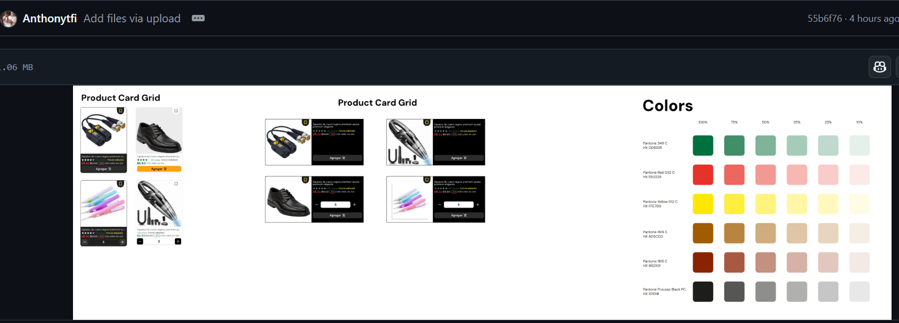
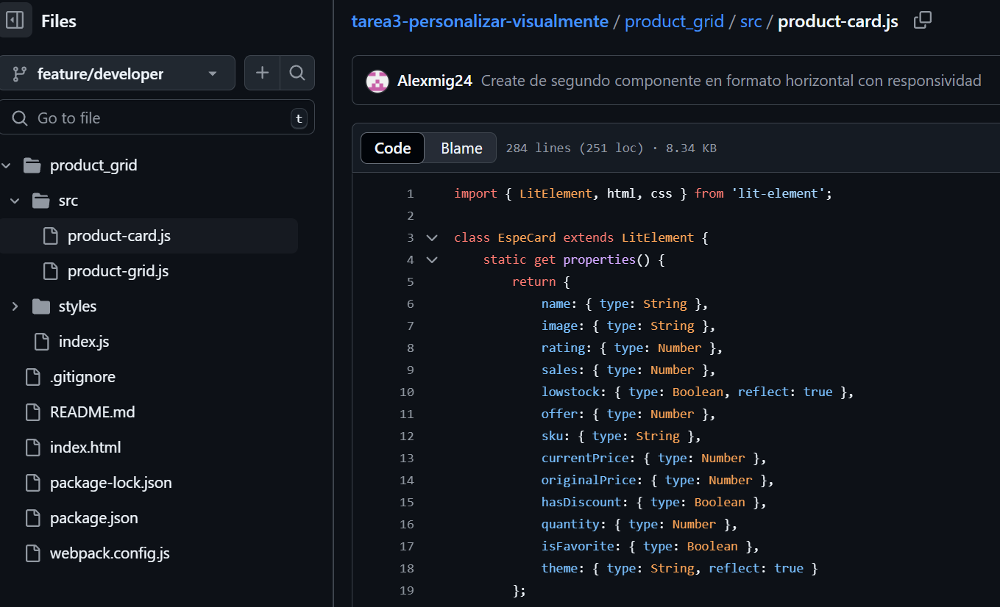
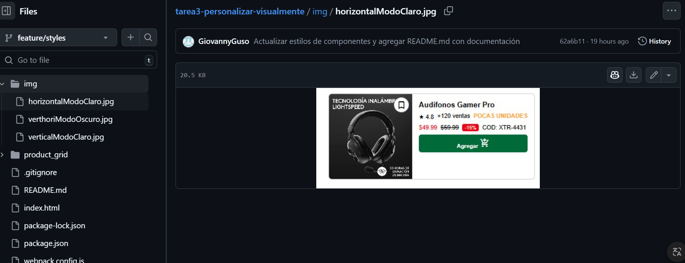
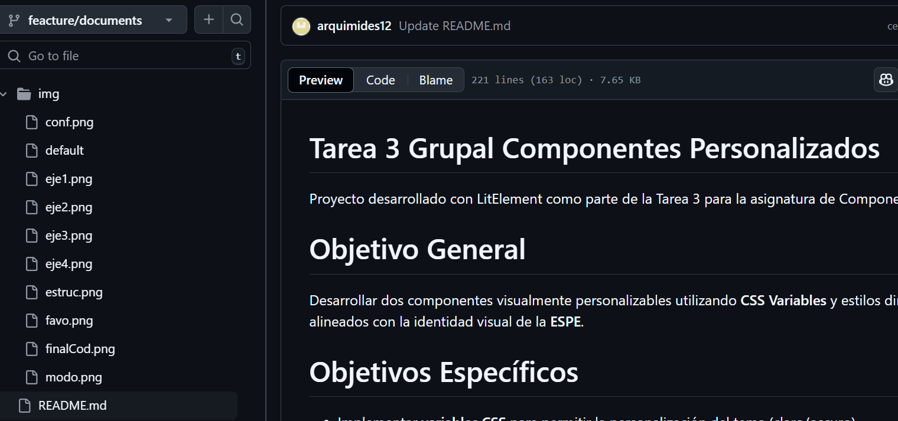
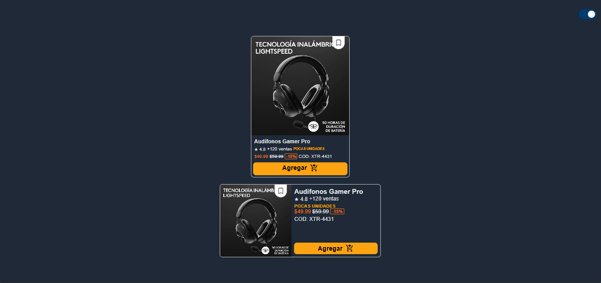
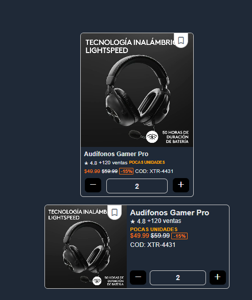
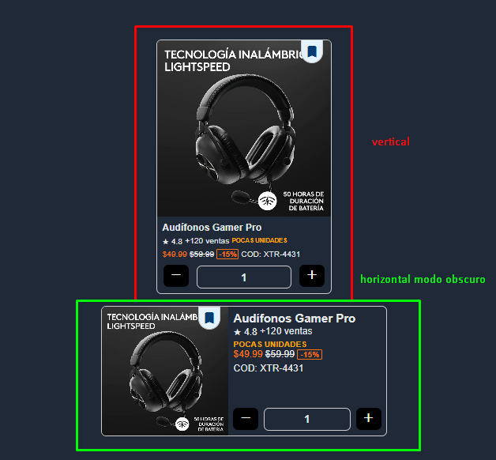
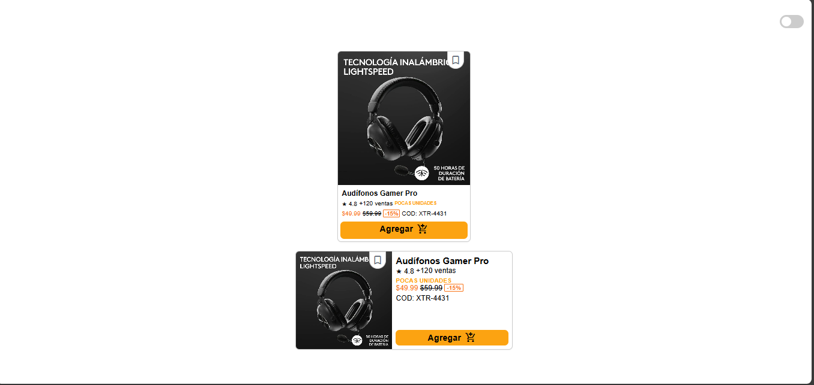
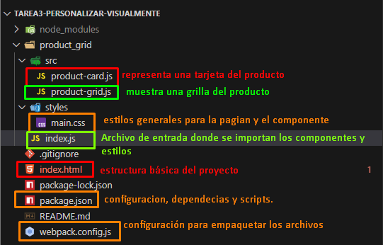
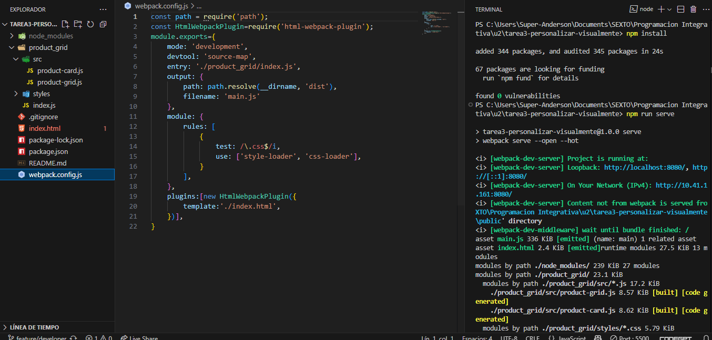

# Tarea 3 Grupal Componentes Personalizados 

Proyecto desarrollado con LitElement como parte de la Tarea 3 para la asignatura de Componentes Personalizados.

# Objetivo General
Desarrollar dos componentes visualmente personalizables utilizando **CSS Variables** y estilos dinámicos en **LitElement**, alineados con la identidad visual de la **ESPE**.

# Objetivos Específicos

- Implementar **variables CSS** para permitir la personalización del tema (claro/oscuro).
- Aplicar **estilos condicionales** según atributos como `lowstock`, `theme`, `hasDiscount`.
- Garantizar **accesibilidad visual**, contraste adecuado y responsividad.
- Integrar **colores institucionales** (verde ESPE `#006935`, amarillo ESPE `#FFE700`) y tipografía Arial/Roboto.


# Roles Y Ramas desarrolladas 


| **Rol**                    | **Responsable**         | **Descripción**                                          |
|----------------------------|--------------|----------------------------------------------------------|
| Diuseñador UI               |Anthony Mejia   | Crear prototipo en Figma alineado al Manual de Imagen de la ESPE.  
| Desarrollador de Componente   |Alexander Quizphe     | Implementar el componente en LitElement con CSS Variables y Shadow DOM | 
| Especialista en Estilos        |Geovanny Duran     | Validar estilos según la identidad de marca y accesibilidad.|
| Tester y Documentador          |Anderson Campos      |	Probar en múltiples navegadores y generar documentación técnica.  |


# Actividades Detalladas

### Diseño en Figma

> - Crear un prototipo de componente alineado al Manual de Imagen de la ESPE.
> - Definir variantes de estilo (ej: tema claro, tema oscuro, estado "agotado").


```bash
https://github.com/Alexmig24/tarea3-personalizar-visualmente/tree/feature/figma 
```
  

### Desarrollo del Componente

- Usar LitElement para crear el componente con:
> -  CSS Variables para colores y espaciado.
> -  Atributos dinámicos (ej: tema, estado, tamaño).

```bash
https://github.com/Alexmig24/tarea3-personalizar-visualmente/tree/feature/developer 
```
  

### Validación de Identidad de Marca

> - Aplicar colores institucionales (#003C71, #FFD700).
> - Usar tipografía Arial/Roboto y espaciado en base 8px.

```bash
https://github.com/Alexmig24/tarea3-personalizar-visualmente/tree/feature/styles
```

  


### Pruebas y Documentación

> - Probar el componente en navegadores modernos (Chrome, Firefox, Safari).
> - Generar capturas de pantalla en el README.md con temas claro y oscuro.
> - Completar README.md con ejemplos de uso y atributos.

```bash
https://github.com/Alexmig24/tarea3-personalizar-visualmente/tree/feacture/documents
```
  

# Componentes
### 1. `<product-card>` (Horizontal)

> Componente tipo ficha horizontal con imagen a la izquierda y detalles a la derecha.
> Este es un componente basado en LitElement, utilizado para representar una tarjeta de producto con detalles visuales.

### Propiedades 
Se definen varias propiedades del componente, como el nombre del producto, la imagen, la calificación, ventas, precios, descuento, entre otros. 

### Métodos 
_toggleFavorite: Cambia el estado de "favorito".

```js
 _toggleFavorite() {
        this.isFavorite = !this.isFavorite;
        this.dispatchEvent(new CustomEvent('favorite-toggle', {
            detail: { isFavorite: this.isFavorite }
        }));
    }
```
  

_addToCart: Agrega el producto al carrito.
```js
_addToCart() {
        this.quantity = 1;
        this.dispatchEvent(new CustomEvent('add-to-cart'));
    }
```
  

_increment y _decrement: Incrementa o decrementa la cantidad del producto en el carrito. 

```js
 _increment() {
        this.quantity++;
        this.dispatchEvent(new CustomEvent('quantity-change', { detail: this.quantity }));
    }

    _decrement() {
        if (this.quantity > 0) {
            this.quantity--;
            this.dispatchEvent(new CustomEvent('quantity-change', { detail: this.quantity }));
        }
    }
```
  

Este componente muestra una tarjeta con la imagen del producto, su calificación, ventas y precio. Los botones permiten agregar el producto al carrito o ajustar la cantidad seleccionada.

## 2. `<product-grid>` (Vertical) & (Horizontal)
> Componente tipo tarjeta vertical con imagen superior y detalles inferiores.
> 
Este archivo define otro componente de LitElement, pero en este caso se trata de una variante del componente product-card en un formato de grilla. 
La estructura básica es similar a la de product-card, pero las tarjetas se presentan de manera más vertical.

Está optimizado para presentar varias tarjetas de productos en una grilla. Cada tarjeta tiene los mismos atributos que en product-card (nombre, imagen, calificación, precio, etc.), pero el diseño está enfocado en la visualización de múltiples productos a la vez. 

  

## 3. `Index.html` 
El archivo HTML contiene el esqueleto básico de la página. Incluye un div con una clase container que alberga los componentes.

espe-product-card
```html
<espe-product-card id="card"
                name="Audífonos Gamer Pro"
                image="https://digitalsmart.ec/wp-content/uploads/2024/01/AUDIFONOS-GAMER-INALMABRICOS-LOGITECH-G-PRO-X-2-LIGHTSPEED-2.jpg"
                rating="4.8"
                sales="120"
                lowstock
                offer="15"
                sku="XTR-4431"
                currentPrice="49.99"
                originalPrice="59.99"
                hasDiscount
                theme="light"
            ></espe-product-card>
```

 espe-card 

```html
<espe-card id="card"
                name="Audífonos Gamer Pro"
                image="https://digitalsmart.ec/wp-content/uploads/2024/01/AUDIFONOS-GAMER-INALMABRICOS-LOGITECH-G-PRO-X-2-LIGHTSPEED-2.jpg"
                rating="4.8"
                sales="120"
                lowstock
                offer="15"
                sku="XTR-4431"
                currentPrice="49.99"
                originalPrice="59.99"
                hasDiscount
                theme="light"
            ></espe-card>
```
## Selector de Tema
En el header hay un botón para alternar entre el tema claro y oscuro. Este botón cambia la clase del cuerpo del documento y el atributo theme de los componentes, lo que permite cambiar el estilo globalmente. 
```html
div class="header">
            <label class="switch">
                <input type="checkbox" id="themeToggle" onchange="toggleTheme()" />
                <span class="slider"></span>
            </label>
        </div>
```

### Estructura de los Componentes

Los componentes se insertan dentro del div.cards-wrapper, mostrando cómo se visualizan las tarjetas de productos.

```html
<div class="cards-wrapper">
            <espe-product-card id="card"
               --- demas contenido 
            ></espe-product-card>
        
            <br>
    
            <espe-card id="card"
                --demas contenido
            ></espe-card>
        </div>
```

> Ejecucion Modo claro



> Ejecucion Modo Obscuro 


## 4. `main.css` 
Este archivo contiene los estilos base para la página y los componentes. Incluye:

- Estilos básicos de cuerpo: Configura el color de fondo y el texto dependiendo de si el tema es claro o oscuro.

- Switch de tema: Establece el diseño y la animación de un interruptor para alternar entre el modo oscuro y el modo claro.

- Estilos para la grilla de tarjetas: Controla la disposición de las tarjetas, la alineación y la presentación de los botones.


# Atributos soportados 

| Atributo       | Tipo     | Descripción                                      |
|----------------|----------|--------------------------------------------------|
| `name`         | `String` | Nombre del producto                              |
| `image`        | `String` | URL de la imagen                                 |
| `rating`       | `Number` | Valor de la calificación (★)                     |
| `sales`        | `Number` | Número de ventas                                 |
| `lowstock`     | `Boolean`| Marca si hay pocas unidades                      |
| `offer`        | `Number` | Porcentaje de descuento                          |
| `sku`          | `String` | Código del producto                              |
| `currentPrice` | `Number` | Precio actual                                    |
| `originalPrice`| `Number` | Precio anterior (tachado si hay descuento)       |
| `hasDiscount`  | `Boolean`| Indica si se muestra el descuento                |
| `quantity`     | `Number` | Cantidad seleccionada en carrito                 |
| `isFavorite`   | `Boolean`| Marca como favorito (con ícono)                  |
| `theme`        | `String` | Soporta: `"light"` (por defecto) o `"dark"`     |


# Estilos Dinamicos y Responsivos 

## Variables CSS utilizadas
```css
--color-primario: #006935;
--color-secundario: #FFE700;
--color-peligro: #DF0303;
--bg-claro: #ffffff;
--bg-oscuro: #1f2937;
--text-claro: #000000;
--text-oscuro: #ffffff;
--font: 'Arial', 'Roboto', sans-serif;
```

## Modo Obscuro 

```html
<espe-card theme="dark" ... ></espe-card>
<espe-product-card theme="dark" ... ></espe-product-card>
```

## Hover Interactivo 
Los botones como “Agregar” y los contenedores `.card` aplican transiciones:
```css
.card:hover {
  transform: scale(1.03);
  box-shadow: 0 4px 12px rgba(0, 0, 0, 0.2);
}

.add-button:hover {
  background-color: #004d26;
}
```

---

## Ejemplo de Uso
```html
<espe-product-card
  name="Audífonos Gamer Pro"
  image="./img/headphones.png"
  rating="4.8"
  sales="120"
  lowstock
  offer="15"
  currentPrice="49.99"
  originalPrice="59.99"
  hasDiscount
  sku="XTR-4431"
  theme="dark"
></espe-product-card>
```

## 4. ` webpack.config.js` 

Webpack se utiliza para empaquetar todos los archivos del proyecto para producción. Este archivo contiene configuraciones como:

- Entrada: Define el archivo de entrada como ./product_grid/index.js.

- Salida: Los archivos empaquetados se colocarán en el directorio dist, con el nombre main.js.

- Módulos: Usa style-loader y css-loader para procesar los archivos CSS y aplicarlos a los componentes.
```js
const path = require('path');
const HtmlWebpackPlugin=require('html-webpack-plugin');
module.exports={
    mode: 'development',
    devtool: 'source-map',
    entry: './product_grid/index.js',
    output: {
        path: path.resolve(__dirname, 'dist'),
        filename: 'main.js'
    },
    module: {
        rules: [
            {
                test: /\.css$/i,
                use: ['style-loader', 'css-loader'],
            }
        ],
    },
    plugins:[new HtmlWebpackPlugin({
        template:'./index.html',
    })],
}
``` 
## 5. ` package.json` 

Este archivo contiene las dependencias del proyecto y las configuraciones de los scripts.

# Estructura del Proyecto

  


## Diferencias entre estilos estáticos y dinámicos 

- **Estilos Estáticos**: definidos directamente con valores fijos en CSS.
- **Estilos Dinámicos con CSS Variables**: permiten cambiar el diseño global desde atributos, soportan temas y facilitan reutilización.

## Ventajas de CSS Variables

- Fáciles de personalizar sin modificar código fuente.
- Permiten heredar estilos en Shadow DOM.
- Compatibles con temas y modo oscuro.
- Mejoran la escalabilidad y mantenimiento del código.

    

  # Conclusiones 

- El efecto de cambio de color en el componente <espe-card> se activa a través del atributo theme, que puede ser light o dark. Dependiendo de su valor, el color de fondo, texto y otros elementos de la tarjeta cambian dinámicamente.
- Los CSS Variables permiten personalizar el diseño sin necesidad de modificar el código directamente, theme permite una personalización visual dinámica en función de los atributos del componente.
- El componente usa un selector de tema para cambiar entre modos claros y oscuros con solo cambiar el atributo theme. 
